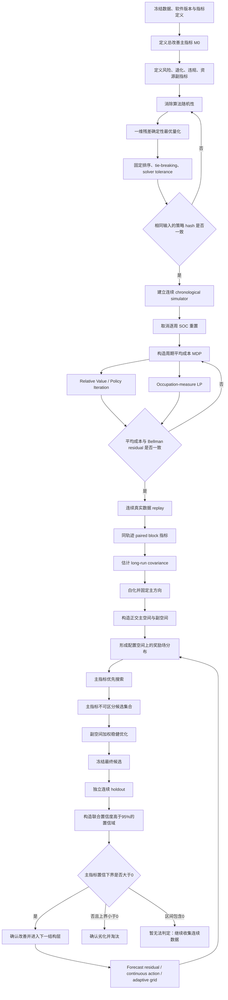

>ask:目前我们只规定置信度需高于95%,不规定最小改善,对于多维度指标的考量,要考虑正交化之后,以总改善为主指标,其余指标为副指标,在正交评估空间内,以主指标子空间为优先优化方向,加权得到评估空间的优化奖励场分布,优先考虑消除随机性和连续真实优化,写一个优化方案,并且以mermaid流程图总结说明当前优化流程,你认为如何

>gpt_answer:我赞成这一方向，但应加三条严格约束：

1. **置信度 (>95%)、不规定最小改善**，则不能预先保证有限样本量；允许的结论必须有三种：
   [
   \text{改善成立},\quad \text{劣化成立},\quad \text{目前无法判定}.
   ]
2. 正交化不能直接用 PCA 把“最大方差方向”当主方向；主指标须先验定义，再对副指标作条件正交化。
3. 加权奖励场适合搜索和排序，但最终选择应采用 **lexicographic optimization**：主指标优先，副指标不得用权重换走一个已经统计显著的主指标优势。

当前最佳基线为 (N_Z=30,\ d_x=d_u=0.1)，平均 score (0.75485)、gain (256.042)，总时间约 4 分钟；但代码仍将数据整理成 672 步周周期并求有限期 SDP。 

# 一、研究目标的正式定义

对站点 (i) 的连续运行轨迹，令候选控制器为 (\pi_\theta)，参考控制器为 (\pi_0)。

## 1. 主指标：总改善

所有能够可靠货币化的量，尽量直接纳入运行成本：

[
c_t^\theta
==========

c_{t,\mathrm{energy}}^\theta
+
c_{t,\mathrm{degradation}}^\theta
+
c_{t,\mathrm{demand}}^\theta
+
c_{t,\mathrm{penalty}}^\theta.
]

连续长期平均成本：

[
g_i(\theta)
===========

\limsup_{T\to\infty}
\frac1T
\mathbb E
\left[
\sum_{t=0}^{T-1}c_{i,t}^\theta
\right].
]

站点改善：

[
\Delta_i(\theta)
================

g_i(0)-g_i(\theta).
]

组合系统的主指标为：

[
\boxed{
M_0(\theta)
===========

\sum_{i=1}^{N}\omega_i\Delta_i(\theta)
}
]

其中

[
\omega_i\ge0,\qquad \sum_i\omega_i=1
]

必须在实验前固定。

若目标是整个资产组合的总收益，则取 exposure weight，例如按运行时长、容量或实际投资规模加权；若目标是“随机一个站点的平均表现”，才取 (\omega_i=1/N)。

---

## 2. 副指标

构造全为“越大越好”的指标向量：

[
m(\theta)=
\begin{bmatrix}
M_0(\theta)\
-\operatorname{CVaR}_{0.95}(C^\theta)\
-\operatorname{EFC}^\theta\
-\operatorname{Violation}^\theta\
-\operatorname{Latency}^\theta\
-\operatorname{RAM}^\theta\
-\operatorname{Flash}^\theta
\end{bmatrix}
\in\mathbb R^p.
]

其中：

* 第一个坐标为主指标；
* 风险、退化、违规、计算资源为副指标；
* 硬安全指标不宜只作为奖励，应先成为约束。

例如：

[
\Pr(\text{SOC violation})=0,
\qquad
t_{\mathrm{WCET}}\le t_{\max},
\qquad
RAM\le RAM_{\max}.
]

不满足硬约束者直接退出评估空间。

# 二、主方向固定的正交化

令同一连续时间块 (b) 上，候选与参考的 paired metric difference 为

[
d_b(\theta)
===========

m_b(\theta)-m_b(0).
]

由连续训练或 validation 数据估计 long-run covariance：

[
\Omega
======

\sum_{k=-\infty}^{\infty}
\operatorname{Cov}(d_b,d_{b+k}).
]

实际使用 HAC 或 block bootstrap 估计 (\widehat\Omega)。若病态，则作 shrinkage：

[
\widehat\Omega_\lambda
======================

(1-\lambda)\widehat\Omega
+
\lambda\operatorname{diag}(\widehat\Omega).
]

先白化：

[
y_b
===

\widehat\Omega_\lambda^{-1/2}d_b.
]

令 (a\in\mathbb R^p) 为主指标选择向量；若第一项就是总改善，则

[
a=e_1.
]

在白化空间中，与原始主指标对应的方向为

[
q_1
===

\frac{
\widehat\Omega_\lambda^{1/2}a
}{
\left|
\widehat\Omega_\lambda^{1/2}a
\right|
}.
]

补成正交矩阵：

[
Q=
\begin{bmatrix}
q_1&Q_\perp
\end{bmatrix},
\qquad
Q^\top Q=I.
]

定义正交评估坐标：

[
\boxed{
z_b
===

# Q^\top y_b

\begin{bmatrix}
z_{1,b}\
z_{\perp,b}
\end{bmatrix}
}
]

则：

* (z_1)：仅代表总改善主方向；
* (z_\perp)：与主改善统计正交的副指标残差；
* 不会重复奖励“成本下降”和与成本高度相关的其他指标。

关键要求是：

[
\boxed{
\widehat\Omega_\lambda,\ Q
\text{ 只能用 calibration/validation 数据估计，并在候选比较前冻结}
}
]

否则坐标系随候选移动，奖励不可比较。

# 三、奖励场分布

在参数或算法配置空间

[
\theta\in\Theta
]

上，每个候选不对应单一点值，而对应正交奖励随机变量的分布：

[
\theta
\longmapsto
\mathcal L(Z_\theta).
]

这就是一个 distribution-valued reward field。

副指标加权奖励定义为：

[
R_\perp(\theta)
===============

w_\perp^\top Z_{\perp,\theta},
]

其中 (w_\perp) 预先固定。

主指标严格优先可写为无穷小标量化：

[
\boxed{
R_\varepsilon(\theta)
=====================

Z_{1,\theta}
+
\varepsilon
w_\perp^\top Z_{\perp,\theta},
\qquad
\varepsilon\downarrow0^+
}
]

其意义不是选择一个随意的小 (\varepsilon)，而是定义 lexicographic order：

[
\theta_a\succ\theta_b
]

当且仅当：

[
\mathbb E[Z_{1,a}]>\mathbb E[Z_{1,b}],
]

或主指标相同、不可区分时：

[
\mathbb E[R_{\perp,a}]

>

\mathbb E[R_{\perp,b}].
]

因此副指标不能补偿一个已经确认的主指标损失。

# 四、95% 联合可信评价

对候选 (\theta)，估计正交均值：

[
\mu_z(\theta)
=============

\mathbb E[Z_\theta].
]

构造联合 (95%) 置信域：

[
\mathcal E_{0.95}(\theta)
=========================

\left{
u:
n(\widehat\mu_z-u)^\top
\widehat\Omega_z^{-1}
(\widehat\mu_z-u)
\le c_{0.95}
\right},
]

其中 (c_{0.95}) 应由 dependent block bootstrap 求得；样本量充足时方可用 (\chi_p^2) 近似。

主指标改善的确认条件为：

[
\boxed{
\inf_{u\in\mathcal E_{0.95}(\theta)}u_1>0
}
]

即总改善的单侧置信下界大于零。

劣化确认条件为：

[
\sup_{u\in\mathcal E_{0.95}(\theta)}u_1<0.
]

其余情况：

[
0\in
\left[
LCB_{0.95}(Z_1),
UCB_{0.95}(Z_1)
\right]
]

则结论为“无法判定”。

因为不规定最小改善，若真实改善无限接近零，则停止时间可能趋于无穷：

[
\boxed{
\delta_{\min}=0
\quad\Longrightarrow\quad
\text{不存在统一有限的样本量保证}
}
]

这不是方法缺陷，而是统计可辨识性的必然结果。

## 多次观察与反复优化

若开发过程中反复查看结果，普通 (95%) 区间会因 optional stopping 失效。

更简单的严格方案是：

* 探索阶段不作统计显著性声明；
* 冻结候选后，在未使用的连续 holdout 上只确认一次。

若确需持续在线观察，则对第 (k) 次正式检查分配

[
\alpha_k>0,
\qquad
\sum_{k=1}^{\infty}\alpha_k\le0.05.
]

例如：

[
\alpha_k
========

0.05\frac{6}{\pi^2k^2}.
]

如此由 union bound 得：

[
\Pr(\text{任意正式检查产生假阳性})
\le0.05.
]

# 五、先消除算法随机性

当前脚本调用：

[
\texttt{fit_linear_noise_model(weeks_data,10)}
]

生成十个噪声节点，同时使用并行站点校准。

优先完成以下确定化。

## 1. 一维残差全局最优量化

AR(1) 残差是一维量，不必采用随机初始化的普通 (K)-means。

将残差排序：

[
\varepsilon_{(1)}
\le\cdots\le
\varepsilon_{(n)}.
]

定义区间量化损失：

[
C(a,b)
======

\min_c
\sum_{j=a}^{b}
(\varepsilon_{(j)}-c)^2.
]

动态规划：

[
D(k,j)
======

\min_{m<j}
\left{
D(k-1,m)+C(m+1,j)
\right}.
]

得到确定的全局最优 (K)-level scalar quantizer：

[
{(\bar\varepsilon_k,p_k)}_{k=1}^{K}.
]

于是：

* 不再需要 seed；
* 不再需要重复若干次；
* 同一输入必得同一噪声离散分布。

## 2. 完全确定性运行

固定：

[
\text{数据排序、浮点类型、tie-breaking、软件版本、solver tolerance}.
]

保存：

[
\operatorname{hash}(
\text{data},
\alpha,\beta,
\varepsilon_k,p_k,
\text{grid},
\pi
).
]

同一配置连续运行两次，应满足：

[
\operatorname{hash}(\pi^{(1)})
==============================

\operatorname{hash}(\pi^{(2)}).
]

这不是统计重复，而是 deterministic reproducibility test。

当前日志还出现了 JLD2 对旧 `EMSx.Result` 类型的字段重建警告；正式实验前应冻结环境并消除 schema/version mismatch。

# 六、连续真实运行优化

当前实现将时间组织为：

[
P=672=7\times96
]

并把训练数据截为完整周。

下一步先保持当前 AR(1) 状态不变，只替换 episodic objective，以隔离“连续化”的真实收益。

## 1. 连续状态

定义周内 phase：

[
\tau_t=t\bmod672.
]

状态：

[
q_t=(\tau_t,x_t,z_t).
]

动态：

[
x_{t+1}=f(x_t,u_t),
]

[
z_{t+1}
=======

\alpha_{\tau_t}z_t
+
\beta_{\tau_t}
+
\varepsilon_{t+1},
]

[
\tau_{t+1}
==========

(\tau_t+1)\bmod672.
]

## 2. 平均成本 Bellman 方程

目标：

[
g^\star
=======

\inf_\pi
\limsup_{T\to\infty}
\frac1T
\mathbb E_\pi
\left[
\sum_{t=0}^{T-1}c(q_t,u_t)
\right].
]

求解：

[
\boxed{
g^\star+h_\tau(x,z)
===================

\min_{u\in U(x)}
\mathbb E
\left[
c_\tau(x,z,u,\varepsilon)
+
h_{\tau+1\bmod P}(x',z')
\right]
}
]

不再设置：

[
x_0=0,\qquad V_{672}=0.
]

由此消除：

[
\text{每周 SOC 重置}
+
\text{周末无终端价值}
]

两类偏差。

## 3. 双求解器交叉验证

正式实现：

[
\text{Relative Value Iteration / Policy Iteration}.
]

在较粗网格上另建 occupation-measure LP：

[
\min_{\mu\ge0}
\sum_{q,u}\mu(q,u)c(q,u)
]

满足稳态流量平衡：

[
\sum_u\mu(q,u)
==============

\sum_{\bar q,\bar u}
\mu(\bar q,\bar u)
P(q\mid\bar q,\bar u).
]

验证：

[
|g_{\mathrm{DP}}-g_{\mathrm{LP}}|
\le
\epsilon_{\mathrm{num}},
]

其中 (\epsilon_{\mathrm{num}}) 由 solver certificate、Bellman residual 与成本尺度决定，而非经验指定。

## 4. 连续 chronological replay

对每个站点使用完整顺序：

[
t=1,\ldots,T_i,
]

不再逐周重置。

测试开始时的 SOC 由测试前实际连续训练段运行所得：

[
x_{\mathrm{test},0}
===================

x_{\mathrm{train},T_{\mathrm{train}}}.
]

因此不需要任意 burn-in。

连续 perfect-foresight oracle 应加入：

[
x_T=x_0
]

或使用长区间边界价值，避免 oracle 在测试结尾无代价放空电池。

# 七、严格的递进实验链

每一步仅改变一个结构因素：

[
\begin{aligned}
A_0:&\ \text{当前随机量化、有限周 SDP};\
A_1:&\ \text{确定性量化、有限周 SDP};\
A_2:&\ \text{确定性量化、连续平均成本 SDP};\
A_3:&\ A_2+\text{forecast-residual state};\
A_4:&\ A_3+\text{continuous-action Bellman minimization};\
A_5:&\ A_4+\text{adaptive state grid};\
A_6:&\ A_5+\text{degradation/risk/resource constraints}.
\end{aligned}
]

由此可以分别估计：

[
\Delta_{\mathrm{randomness}},
\quad
\Delta_{\mathrm{continuity}},
\quad
\Delta_{\mathrm{forecast}},
\quad
\Delta_{\mathrm{action}},
\quad
\Delta_{\mathrm{grid}}.
]

避免同时修改多个模块后无法归因。

# 八、候选选择规则

对每个候选 (\theta)，先计算主指标区间：

[
[L_1(\theta),U_1(\theta)].
]

令当前最强主指标下界为：

[
L^\star=\max_{\eta\in\Theta}L_1(\eta).
]

定义主指标不可区分集合：

[
\boxed{
\Theta_{\mathrm{main}}
======================

\left{
\theta:
U_1(\theta)\ge L^\star
\right}
}
]

集合外的候选已被确认主指标更差，不得依赖副指标权重补偿。

集合内再优化副空间奖励：

[
\boxed{
\theta^\star
============

\arg\max_{\theta\in\Theta_{\mathrm{main}}}
\inf_{u\in\mathcal E_{0.95}(\theta)}
w_\perp^\top u_\perp
}
]

即：

1. 主指标置信意义下优先；
2. 在主指标不可区分者之间；
3. 选择副指标最坏可信收益最大的方案。

# 九、流程图

# 结论

这套方案的核心不是“把所有指标随意加权成一个数”，而是：

[
\boxed{
\text{确定性控制模型}
\rightarrow
\text{连续平均成本优化}
\rightarrow
\text{固定主方向的正交评估}
\rightarrow
\text{分布型奖励场搜索}
\rightarrow
\text{95% 联合可信的层级决策}
}
]

我认为它比当前继续加密 (N_Z) 更合理。第一阶段应只做两件事：

[
\boxed{
\text{确定性残差量化}
+
\text{周期无限期 average-cost SDP}
}
]

先得到无随机扰动、无周界效应的连续基准，之后所有预测模型、网格、动作和风险优化才有可解释的增量。
